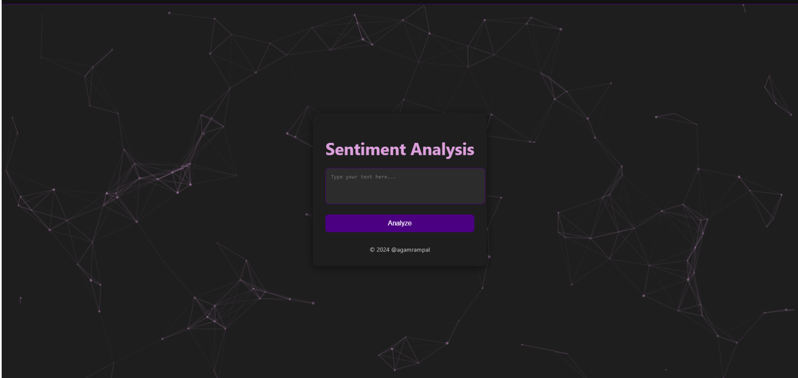
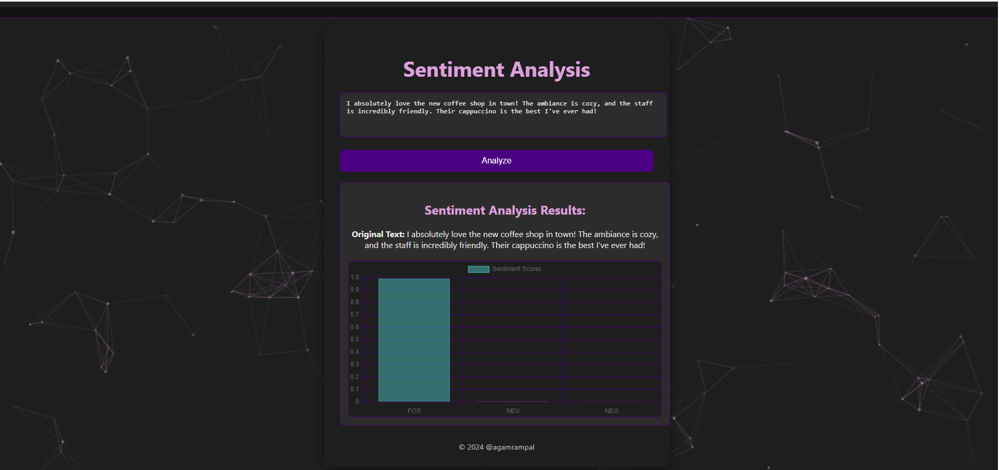

# SentimentSense - Sentiment Analysis Web Application 💬🔍

SentimentSense is a web application built with Flask that provides sentiment analysis of user input. It utilizes Hugging Face's pre-trained sentiment analysis model to determine whether the text is positive, negative, or neutral. The results are visualized with a bar chart and a dynamic particle background, making the web experience both interactive and engaging.

---

## Features 🌟

- **Sentiment Analysis**: Real-time analysis of user input using the bertweet-base-sentiment-analysis model from Hugging Face. 🤖
- **Data Visualization**: Sentiment scores displayed in a colorful bar chart using **Chart.js**. 📊
- **Interactive Background**: A dynamic, animated particle background with **Particles.js**. 🎆
- **User-friendly Interface**: Simple and clean UI to input text for analysis. 🖥️

---

## Images 📸
Here are some examples of the UI and results:

## Technologies Used 🛠️

- **Flask**: Python web framework for building the backend. 🐍
- **Hugging Face API**: Pre-trained sentiment analysis model. 🌐
- **Chart.js**: JavaScript library to display sentiment scores in a bar chart. 📈
- **Particles.js**: JavaScript library for creating dynamic particle animations. ✨
- **HTML/CSS**: Structure and design of the frontend. 🎨
- **Python-dotenv**: Securely load environment variables like the Hugging Face API token. 🔐

---

## Access the Web App 🌐

Open a web browser and navigate to https://sentimentsense-4yg9.onrender.com/ to use the sentiment analysis tool. 🖥️

## How It Works ⚡

- **User Input**: The user types text in the provided textarea and submits the form. ✍️

- **API Call**: The text is sent to the Hugging Face API for sentiment analysis. 🔄

- **Results**: The sentiment labels (positive, negative, neutral) and corresponding scores are received and displayed in a Chart.jsbar chart. 📊

- **Interactive Features**: The page also features a dynamic particle system in the background that responds to user interactions. 🌠

