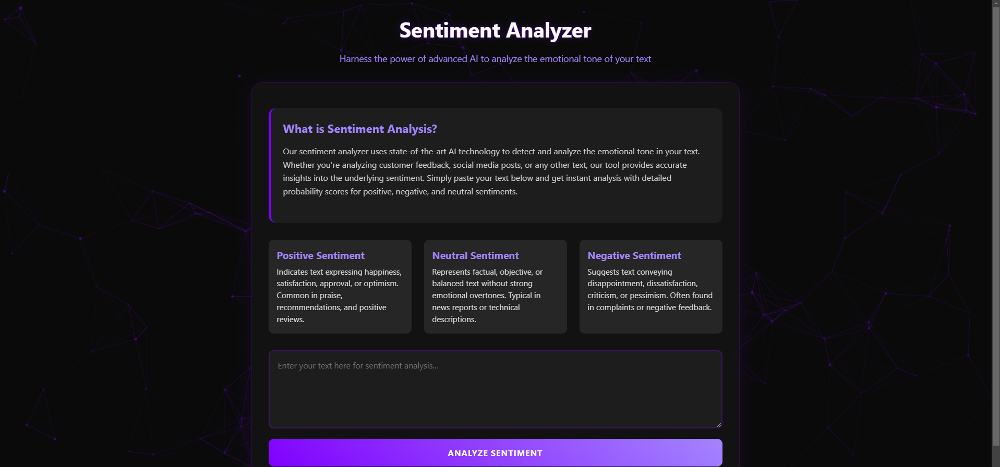
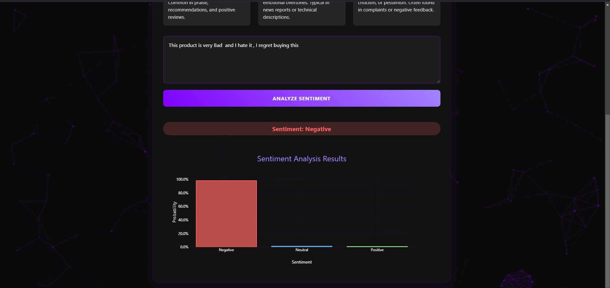

# Sentiment Sense

Welcome to Sentiment Sense! This project is your ultimate tool for analyzing the sentiment of any text input. Trained on a diverse Twitter dataset, it is designed to generalize well for various kinds of text input, not just tweets. You can use it to analyze sentiment in just about any text and uncover the emotions hidden in words.

---

## Table of Contents

- [Overview](#overview)
- [Demo](#demo)
- [Architecture](#architecture)
  - [Frontend](#frontend)
  - [Backend](#backend)
- [Custom Transformer-Based Model](#custom-transformer-based-model)
  - [Model Components](#model-components)
- [Data Handling & Preprocessing](#data-handling--preprocessing)
- [Features](#features)
- [Usage and Setup](#usage-and-setup)
- [Model Details](#model-details)
- [Contributing](#contributing)
- [License](#license)

---

## Overview

**Sentiment Sense** is a complete full-stack web application designed to determine the sentiment behind any text input accurately. Powered by a custom Transformer-based model built entirely from scratch in PyTorch, it offers fast inference and detailed probability distributions across three key sentiments: Positive, Negative, and Neutral.

The backend is built with FastAPI to ensure robust and rapid responses, while the frontend is a lightweight, responsive interface crafted with vanilla HTML, CSS, and JavaScript, ensuring a seamless user experience.

---

## Demo

Here is a look at the deployed user interface for Sentiment Sense:




---

## Architecture

The project is divided into two main architectural components:

### Frontend
The frontend is a lightweight, responsive single-page application that provides a clean and intuitive user interface without the overhead of complex frameworks.
- **Technologies Used**: HTML5, CSS3, Vanilla JavaScript.
- **Functionality**: Users input text into a straightforward search/input field. The frontend captures the input and sends an asynchronous HTTP POST request to the backend API. It handles loading states and displays the parsed response (the dominant sentiment and a probability graph).
- **Deployment**: The frontend is optimized for deployment on Vercel.

### Backend
The backend serves as the core processing engine, housing the RESTful API and the machine learning model.
- **Technologies Used**: Python, FastAPI, PyTorch, NLTK, Uvicorn.
- **API Endpoints**: 
  - `GET /health` and `GET /`: Health check endpoints to verify the API is running.
  - `POST /api/analyze` or `POST /analyze`: The main inference endpoints. It expects a JSON payload containing the text string and returns a detailed JSON response containing the predicted sentiment, exact class probabilities, and a data payload to render visualization graphs.
- **Gradio Integration**: A Gradio web interface is also mounted to the FastAPI app for quick and interactive testing.
- **Deployment**: The backend can be hosted on platforms like Hugging Face Spaces or Render, offering high-performance inference instances.

---

## Custom Transformer-Based Model

At the core of **Sentiment Sense** is the `TwitterSentimentTransformer`, a custom-built, deep learning model implemented in PyTorch from the ground up. This avoids reliance on pre-trained models like BERT or DistilBERT, demonstrating a profound understanding of modern attention mechanisms.

### Model Components

1. **Embedding Layer**: Converts input tokens from the vocabulary into dense vectors of dimension 256 (`d_model=256`).
2. **Positional Encoding**: Since Transformers lack an inherent sense of sequence order, a custom `PositionalEncoding` module injects sine and cosine-based position information into the embeddings, allowing the model to understand the sequence and position of words.
3. **Stacked Transformer Blocks**: The model utilizes 4 layers of custom `TransformerBlock`s. Each block contains:
   - **Multi-Head Attention**: 8 attention heads allow the model to focus on different parts of the input text simultaneously, learning complex dependencies between words regardless of their distance.
   - **Residual Connections & Layer Normalization**: Helps stabilize the learning process and prevents the vanishing gradient problem in deep networks.
   - **Feed-Forward Neural Network**: Further processes the output of the attention mechanism (`d_ff=1024`).
   - **Dropout**: Applied at a rate of 0.1 to prevent overfitting.
4. **Classification Head**: After the input passes through the transformer blocks, the model applies Global Average Pooling over the sequence dimension to produce a fixed-size representation of the entire text. This vector is passed through fully connected linear layers resulting in logits for the 3 target classes: Negative, Neutral, and Positive.

---

## Data Handling & Preprocessing

The text preprocessing pipeline is critical for the model's accuracy, acting as the bridge between raw user input and token ingestion. It heavily utilizes the Natural Language Toolkit (NLTK) and regular expressions.

**Steps included in text preprocessing:**
1. **Cleaning**: The raw string is first normalized to lowercase.
2. **Noise Removal**: 
   - Hyperlinks (`http...` / `www...`) and HTML tags are entirely removed.
   - Twitter-specific artifacts like handles (`@username`) are replaced with a generic `@user` token.
   - Hashtag symbols (`#`) are stripped, but the word itself is retained.
   - All standard punctuation marks and numerical digits are removed to focus exclusively on alphabetical features.
3. **Tokenization and Lemmatization**: The cleaned string is split into individual internal tokens using NLTK's `word_tokenize`. Each token is then lemmatized using `WordNetLemmatizer` to reduce words to their base or dictionary form.
4. **Stopword Elimination**: Common English stopwords (e.g., 'the', 'is', 'in') are removed using NLTK's predefined lists, leaving only words that carry significant semantic value.
5. **Vocabulary Mapping and Padding/Truncation**: The remaining tokens are matched against the pre-computed custom vocabulary (`vocab.json`). If a token is completely unseen, it is mapped to an `<UNK>` (Unknown) token. The sequence is then explicitly padded or truncated to a fixed maximum length of 128 elements to be compatible with the tensor shapes required by the PyTorch model.

---

## Features

- **Versatile Sentiment Analysis**: Works seamlessly for tweets, comments, product reviews, generic feedback, or any standard text input.
- **Detailed Probability Output**: Instead of just a single label, the API returns exact probability scores for all three sentiment classes, visualizing the network's confidence.
- **FastAPI Backend**: Ensures rapid responses and high concurrency capabilities.
- **Interactive UI**: Includes an isolated frontend web app and a Gradio interface built directly into the FastAPI backend.

---

## Usage and Setup

To run this application locally, you will need to start both the Python backend API and the local frontend server.

### Backend Setup (API)

1. Navigate to the `Backend` directory:
   ```bash
   cd Backend
   ```
2. Create and activate a virtual environment:
   ```bash
   python -m venv venv
   source venv/bin/activate  # On Windows: venv\Scripts\activate
   ```
3. Install the required dependencies:
   ```bash
   pip install -r requirements.txt
   ```
4. Start the FastAPI server using Uvicorn:
   ```bash
   python app.py
   # Or using uvicorn directly:
   # uvicorn app:app --host 0.0.0.0 --port 7860 --reload
   ```
5. The API will now be running at `http://localhost:7860`. You can visit `http://localhost:7860/docs` to view the interactive Swagger API documentation. The Gradio interface will be accessible at the root route `/`.

### Frontend Setup

1. Open a new terminal instance and navigate to the `Frontend` directory:
   ```bash
   cd Frontend
   ```
2. Serve the directory using any local web server. For example, using Python's built-in `http.server`:
   ```bash
   python -m http.server 3000
   ```
3. Open your browser and navigate to `http://localhost:3000`.
4. Enter any text into the main textbox and click "Analyze" to see the sentiment predictions.

---

## Contributing

We welcome contributions from the community to improve Sentiment Sense! 

1. Fork the repository.
2. Create a new branch:
   ```bash
   git checkout -b feature/YourFeatureName
   ```
3. Make your changes and commit them:
   ```bash
   git commit -m "Add Your Feature"
   ```
4. Push to the branch:
   ```bash
   git push origin feature/YourFeatureName
   ```
5. Open a Pull Request on GitHub.

---

## License

This project is licensed under the MIT License. See the `LICENSE` file in the repository root for more details.

---

Thank you for checking out Sentiment Sense! We hope it brings clarity and valuable quantitative insights to the sentiments hidden in your text data. Happy analyzing!
