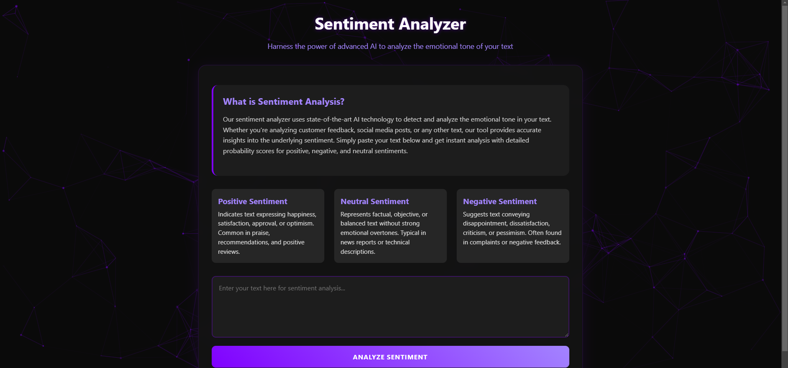

# Sentiment Sense 🎉

Welcome to **Sentiment Sense**! 🌟 This project is your ultimate tool for analyzing the sentiment of any text input. Trained on a diverse Twitter dataset, it’s not just limited to tweets — you can use it to analyze sentiment in just about any text. Let’s dive in and uncover the emotions hidden in words! 🎨

## Table of Contents 🔖

- [Overview](#overview-)
- [Features](#features-)
- [Demo](#demo-)
- [Usage](#usage-)
- [Model Details](#model-details-)
- [Contributing](#contributing-)
- [License](#license-)

## Overview 🔍

**Sentiment Sense** is a web application designed to determine the sentiment behind any text input. Powered by a custom Transformer-based model trained on a Twitter dataset, it offers accurate and insightful sentiment analysis. The backend is built with FastAPI and hosted on Hugging Face, while the frontend is crafted with care and deployed on Vercel.

## Features ✨

- **Versatile Sentiment Analysis**: Works for tweets, comments, reviews, or any text input.
- **User-Friendly Interface**: Designed with simplicity and elegance for a seamless user experience.
- **FastAPI Backend**: Ensures robust and rapid responses.
- **Deployed on Vercel**: Enjoy a fast and reliable performance.

## Demo 🎥

Try out the live application here: [Sentiment Sense Live Demo](https://sentiment-sensor-fe.vercel.app)



## Usage 🚀

Once both the backend and frontend servers are running:

1. Open your browser and navigate to `http://localhost:3000`.
2. Enter any text you'd like to analyze — from tweets to product reviews.
3. Hit the "Analyze" button and let **Sentiment Sense** reveal the sentiment behind the words! 🎉

## Model Details 🧠

At the core of **Sentiment Sense** is a custom Transformer-based model trained on a diverse Twitter dataset. It’s designed to generalize well for various kinds of text input. For a deeper dive into the model’s architecture, training process, and performance, refer to the `main.ipynb` notebook in the repository.

## Contributing 🧱

We welcome contributions from the community! If you'd like to enhance **Sentiment Sense**:

1. Fork the repository.
2. Create a new branch:

   ```bash
   git checkout -b feature/YourFeatureName
   ```

3. Make your changes and commit them:

   ```bash
   git commit -m 'Add Your Feature'
   ```

4. Push to the branch:

   ```bash
   git push origin feature/YourFeatureName
   ```

5. Open a Pull Request and let’s collaborate to make **Sentiment Sense** even better! 🌟

## License 🔒

This project is licensed under the MIT License. See the [LICENSE](LICENSE) file for more details.

---

Thank you for checking out **Sentiment Sense**! We hope it brings clarity and insights to the sentiments hidden in words. Happy analyzing! 😊
